## 2026 Scholars

::: columns
::: {.column width="30%"}
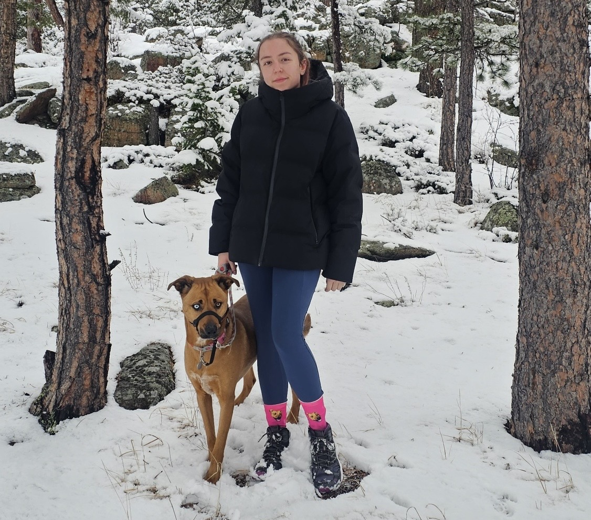{width=250px}
:::
::: {.column width="70%"}
Ella is an MS student in Applied Mathematics at CU Denver. She also earned her BS in Mathematics with a minor in Data Science at CU Denver as well. She is joining the program because she is excited to deepen her knowledge about statistics, data science, and how to apply that to genetic research. Outside of academics, her other interests include hiking, camping, and enjoying the Colorado outdoors!
:::
:::

::: columns
::: {.column width="30%"}
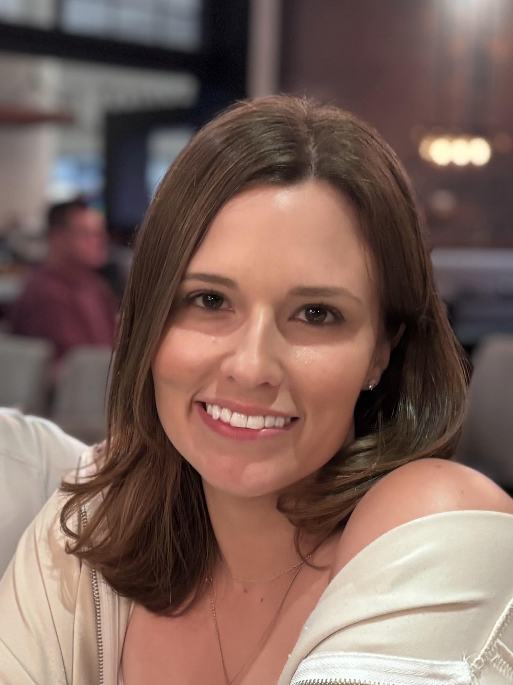{width=250px}
:::
::: {.column width="70%"}
Since graduating from CU Boulder in 2019, Alexis has worked as a research assistant in a lung cancer lab at CU Anschutz, studying airway stem-progenitor cells and their role in disease development and progression. From growing patient-derived organoids to calling variants from whole-exome sequencing data, Alexis has developed a love for statistical analysis. She is excited to start an MS in Statistics at CU Denver and looks forward to the opportunity to gain dry-lab experience through the PATH-GDS program. In her spare time, she enjoys spending time with her pets, reading, and hiking.
:::
:::

::: columns
::: {.column width="30%"}
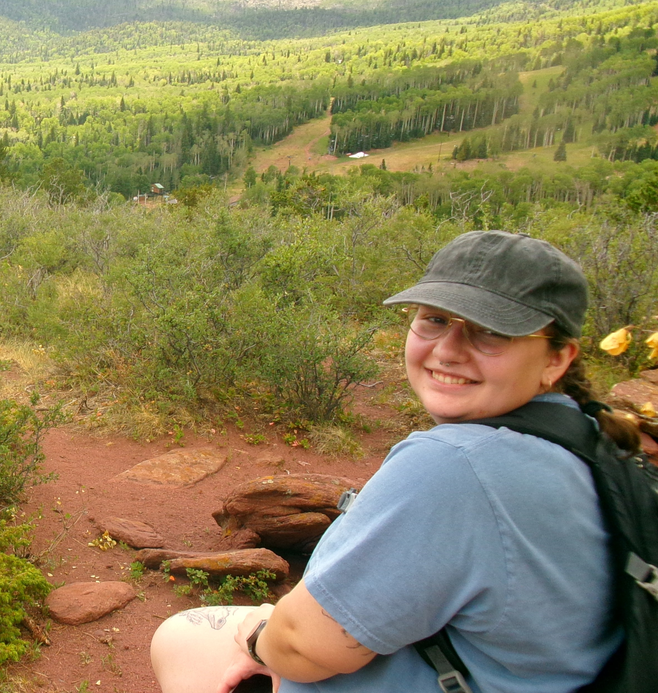{width=250px}
:::
::: {.column width="70%"}

Sophie was born and raised in Colorado before completing her undergraduate degree in Biology with a concentration in Statistics and Data Science at St. Olaf College in Northfield, Minnesota. Through PATH-GDS she hopes to find new ways to combine her biological and statistical background to contribute to reliable research and effective science communication. Sophie loves to hike, spend time outdoors with family, read, and play rugby.
:::
:::

::: columns
::: {.column width="30%"}
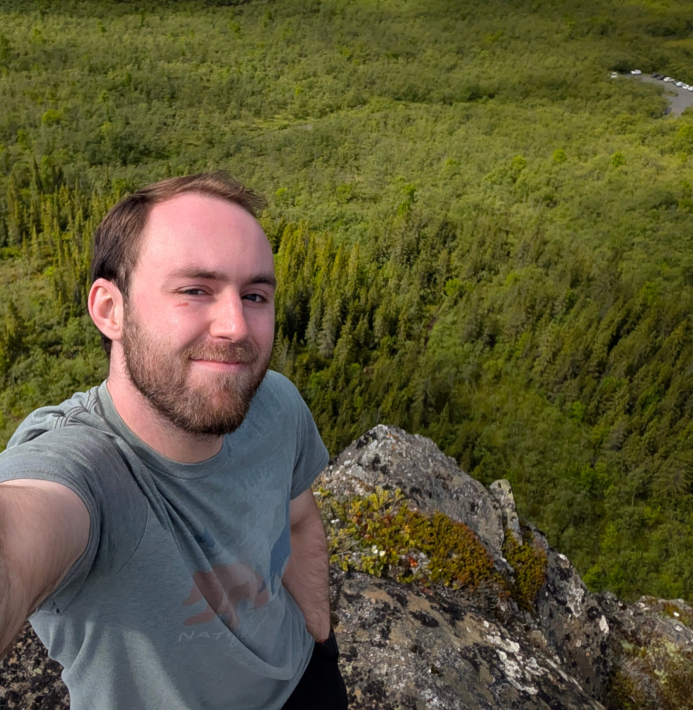{width=250px}
:::
::: {.column width="70%"}
Shea is a Master's student in Statistics. From Colorado, Shea grew up in Massachusetts before moving to Ontario for his undergraduate studies. He earned his bachelor's degree from the University of Toronto, where he completed a double major in Applied Statistics and Mathematical Sciences. He joined PATH-GDS because of his interest in the applications of statistics and data science to disease research and is excited for the opportunity to gain research experience. Outside of academics, he enjoys climbing, biking, hiking, as well as reading and watching movies.
:::
:::

## 2025 Scholars

### Adam Giacalone

::: columns
::: {.column width="30%"}
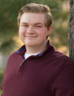{width=250px}
:::

::: {.column width="70%"}
Adam is an MS in Statistics student at CU Denver.  He completed his BS in mathematics with a focus in probability and statistics with a minor in biology.  Adam is a Denver native, living in the city his entire life.  From a young age to his undergrad, Adam always had an interest in STEM fields, particularly in mathematics and biology.  Path-GDS provides an opportunity to finally explore the intersection of his interests while also contributing meaningfully in better understanding disease and health outcomes.  Outside of academics and research, Adam has hobbies in cooking, gardening, video games, and all types of horror media.
:::
:::

### Harshini Ranjit

::: columns
::: {.column width="30%"}
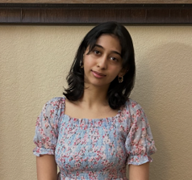{width=250px}
:::

::: {.column width="70%"}
Harshini is an MS in Statistics student at CU Denver. She completed her undergraduate degree as a biology major and a data science minor at CU Denver. She loves working in the lab and wants to pursue research within the field of molecular genetics and precision medicine. The PATH-GDS program provides her with the perfect opportunity to explore her passion. Apart from academic research, she also loves to dance and play sports like tennis/badminton.
:::
:::

### Maxwell Stevens

::: columns
::: {.column width="30%"}
{width=250px}
:::

::: {.column width="70%"}
Maxwell Stevens obtained his BS in Applied Mathematics with a minor in Comp. Sci. at CU Denver and is currently working toward his MS in Applied Mathematics at CU Denver. As a high school dropout, Maxwell started down his path as a mathematician at Front Range Community College where he first gained his lover for mathematics. While Maxwell worked on his BS, his mother was diagnosed with a glioblastoma, an aggressive form of brain cancer. In this experience, Maxwell gained his drive to do genomics research in order to learn more about diseases that plague so many families. Outside of academics, Maxwell enjoys spending time with his family and enjoying the great outdoors. One can often find Maxwell exploring the many great hiking trails the front range of Colorado has to offer.
:::
:::

## Alumni Scholars

### Matthew Joel

::: columns
::: {.column width="30%"}

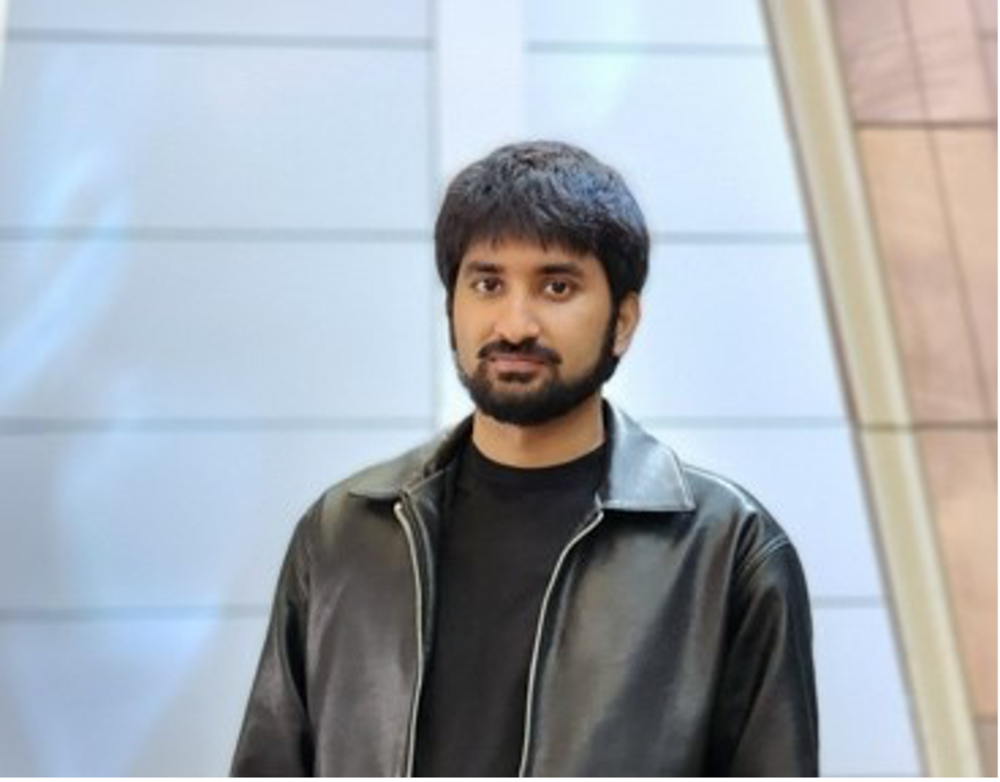{width=250px}
:::

::: {.column width="70%"}

Matthew is an MS in Statistics at CU Denver. Matthew is a Colorado native who also completed his undergrad in mathematics there. His academic journey has taken many turns, starting in biomedical engineering before merging his love of math and biology through the Path-GDS program. Matthew's curiosity extends beyond academics—he's always enjoyed modding video games and picked up computer science as a minor. He’s also an avid motorsports fan, especially into drifting, and loves working on cars. His passion for data science comes from its versatility, and he hopes to use his skills to make an impact in genomic data science, ultimately aiming to make a difference in others' lives. 

:::
:::

### Davyd Sadovskyy

::: columns
::: {.column width="30%"}

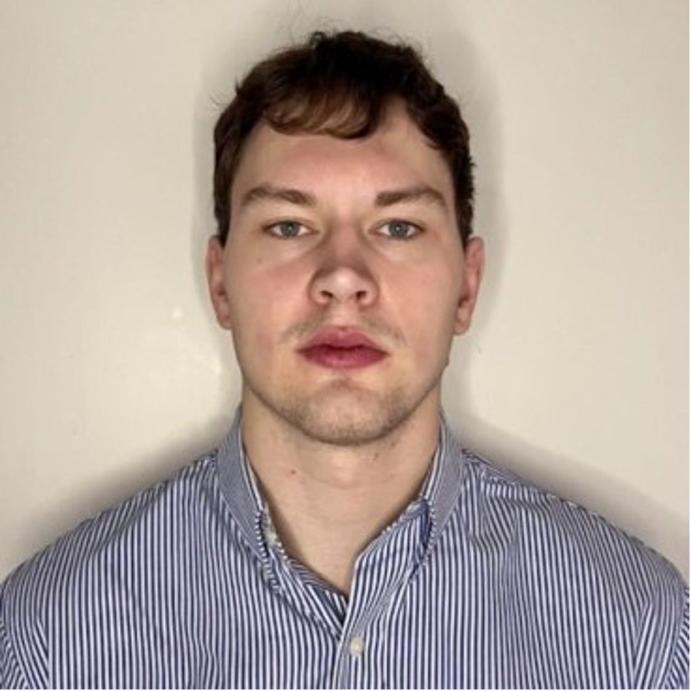{width=250px}
:::

::: {.column width="70%"}

Davyd attended Miami University in Ohio and double majored in biology and data science/statistics. He hasn’t had much research experience but is excited to gain that from PATH-GDS. Davyd is most interested in studying the ways human health and performance can be optimized with drugs or other data driven interventions. In his free time, he enjoys lifting and competitive arm wrestling.

:::
:::

### Johannes Strauss

::: columns
::: {.column width="30%"}

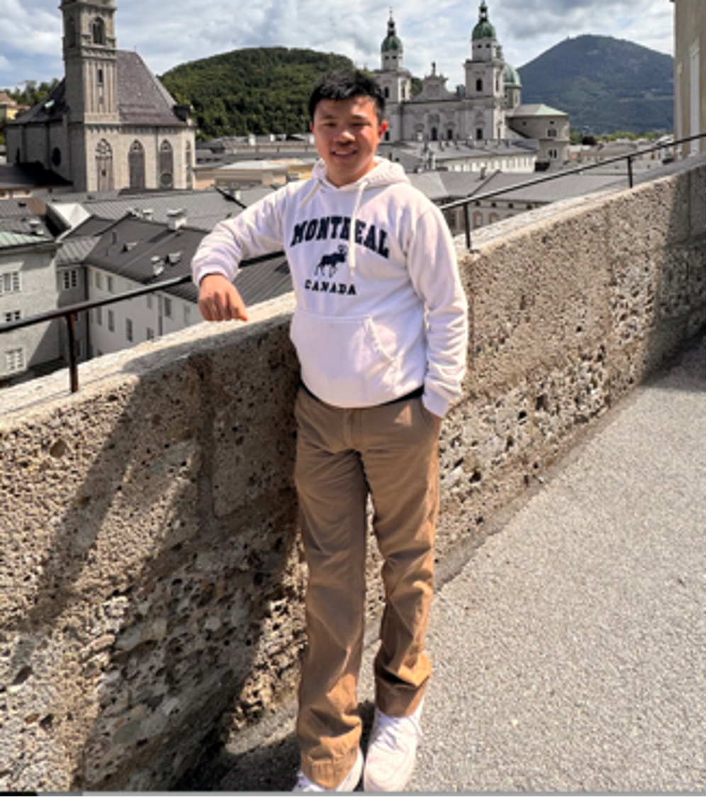{width=250px}
:::

::: {.column width="70%"}
Johannes is a second-year Master's student in statistics. Originally from northeastern China, he moved to the United States at the age of ten. He completed his undergraduate studies in mathematics at the University of Colorado Denver. Johannes joined PATH-GDS because of his passion for interdisciplinary work, focusing on the application of mathematical methods to solve real-world problems. His interest lies within Uncertainty Quantification, especially Bayesian approaches in UQ problems. Outside of academics, Johannes enjoys outdoor activities, attending and supporting the opera and symphony, and savoring good German beer and enjoys making authentic Chinese food. 
:::
:::

### Keshav Vembar

::: columns
::: {.column width="30%"}

{width=250px}
:::

::: {.column width="70%"}
Keshav is an MS students in Applied Mathematics at CU Denver. He earned a Bachelor's degree in Computer Science with a minor in math from Colorado School of Mines. His passion is in mathematics, and he wants to make a positive difference in the world through research. Keshav sees PATH-GDS as a way to learn how to apply his math skills to real-world applications in genomics. Outside of academics, Keshav loves music, playing guitar, and hiking through Colorado. 
:::
:::

### Emily Aaron

::: columns
::: {.column width="30%"}

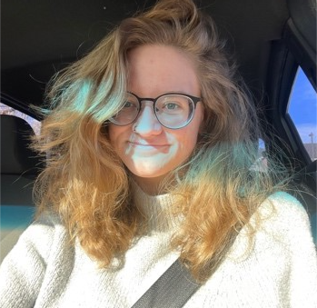{width=250px}
:::

::: {.column width="70%"}
Emily is an MS student in Statistics at CU Denver. Emily is from Colorado and did her undergraduate studies at MSU Denver in Mathematics and Biology. She is joining the program because she wants to be a biostatistician after earning her masters. As someone with a genetic illness, she hopes to use genomic data science to understand the complexity of DNA and its mishaps more.
:::
:::

### Tristen Orndorff

::: columns
::: {.column width="30%"}

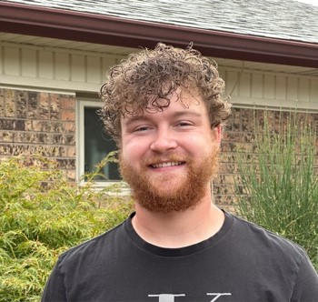{width=250px}
:::

::: {.column width="70%"}
Tristen is an MS student in Statistics. He is from Albuquerque New Mexico and did his undergrad at The University of New Mexico in statistics.  He joined PATH-GDS because the idea of applying what he is learning and getting a better idea of what he will do in his career is exciting. 
:::
:::

### Shane Ridoux

::: columns
::: {.column width="30%"}

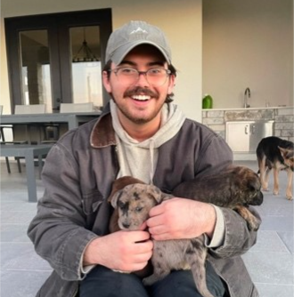{width=250px}
:::

::: {.column width="70%"}
Shane is an MS student in Statistics at CU Denver.  Shane is from New Jersey and did his undergraduate studies at Trinity University in San Antonio. He joined PATH GDS to combine his passion for Mathematics with his goal of helping those with neurodegenerative diseases such as ALS.
:::
:::

### Souha Tifour

::: columns
::: {.column width="30%"}

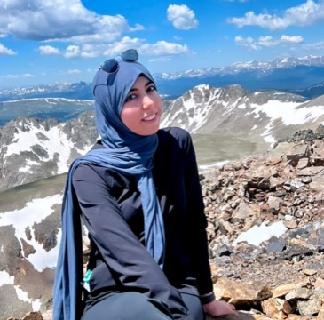{width=250px}
:::

::: {.column width="70%"}
Souha graduated from CU Denver with a Statistics MS in Spring 2024. She completed her undergraduate studies in Mathematics at the University of Colorado Denver. Souha’s passion lies in the development and application of statistical models, particularly within the realm of genetics. By engaging in this field, she aspires to contribute to the advancement of scientific understanding of diseases and uncover potentially effective strategies for enhancing health. 
:::
:::